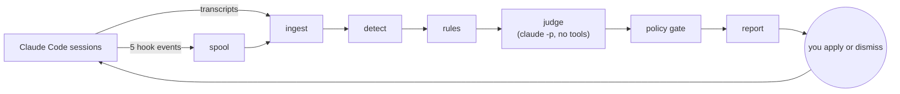

# Observer

A background friction logger for the AI agents on your Mac. It reads what your Claude Code sessions, subagents, and skills did, logs where they struggled, and each morning writes a short ranked list of concrete changes: a permission rule to add, a CLI to install, a directory to grant, a line of context to stop retyping, an agent that needs tuning. It never applies anything itself; it detects when you did and measures whether the friction went away.

Design and rationale are in [docs/superpowers/specs/2026-10-02-observer-agent-design.md](docs/superpowers/specs/2026-10-02-observer-agent-design.md).

## Quick start

Requires Python 3.9 or later (the macOS system `python3` works) and nothing else. The optional judge step uses your existing `claude` CLI login.

```bash
make doctor      # finds your transcripts, the claude CLI, hooks, schedule
make run-rules   # backfills the last 30 days and writes a report, no LLM
make report      # read it
make install     # add the hooks and a daily 06:00 launchd job
```

Before deploying, run `/insights` in Claude Code once. It is the built-in, one-off version of this analysis and a good baseline.

## How it works



1. **Capture.** Transcripts under `~/.claude/projects` are the primary source; they include subagent transcripts, the active skill, and every tool result. A tiny hook records what transcripts cannot show, mainly permission prompts you approved and auto-mode denials. The hook only appends a line to a file; it prints nothing and always exits 0.
2. **Detect.** Code classifies friction: tool errors by class, rejections, denials, permission prompts, interruptions, corrections, retry loops, statements like "I don't have access to", API failures, and instructions you typed into three or more sessions.
3. **Recommend.** Rules turn recurring friction into candidates with the exact change, following a ladder from least to most privilege: context, then contraction, then scoped permissions, then directory access, then new tools. Broad access is never recommended.
4. **Judge (optional).** One `claude -p` call per day with no tools and no session persistence reviews aggregated evidence, attributes causes, and can drop a weak candidate or propose a few more.
5. **Gate.** A deterministic policy check has the final say. It blocks wildcard, network, interpreter, and destructive rules, secret paths, broad directories, settings other than permission lists, and suspicious context text. Every recommendation must cite evidence that exists in the database.
6. **Close the loop.** Applied changes are detected automatically where possible (the rule is in a settings file, the CLI is on PATH, the line is in CLAUDE.md). Seven days later the observer compares the friction rate before and after and reports the change as verified or not effective.

### When it recommends more access

All five must hold: the friction recurred (3 times across 2 sessions in 14 days by default), the cause is a missing capability or access rather than a model mistake, a context line would not fix it, every related prompt was approved, and the gate rates the change low or medium risk.

### Underperforming agents

Each main session, skill, and subagent type gets a problem rate per 100 tool calls. An agent with at least 20 calls whose rate is more than twice the median gets a `tune_agent` recommendation pointing at its SKILL.md or agent definition.

## Using the report

The report is at `~/.observer/reports/latest.md`, with one dated file per day alongside it. Its sections are Do today, Consider, Blocked by policy, Applied changes, Agent scorecard, Friction seen, and Pipeline health.

```bash
python3 -m observer list              # open recommendations
python3 -m observer show r1a2b3c4     # patch, evidence, examples
python3 -m observer done r1a2b3c4     # for changes it cannot detect itself
python3 -m observer dismiss r1a2b3c4 --reason "I push by hand"
```

A dismissed item stays hidden until its evidence doubles.

## Configuration

Optional `~/.observer/config.json`; every key has a default in `observer/config.py`.

```json
{
  "window_days": 14,
  "min_occurrences": 3,
  "min_sessions": 2,
  "judge_model": "opus",
  "judge_effort": "medium",
  "judge_max_budget_usd": 2.0,
  "transcript_roots": ["~/.claude/projects"]
}
```

Set `"judge_enabled": false` to run rules only.

## Data and privacy

Everything stays in `~/.observer` with owner-only permissions: `observer.db` (SQLite), `spool/`, `reports/`, `logs/`. Excerpts are redacted for common secret formats and truncated before storage. The judge receives aggregated clusters with at most three short excerpts each, never full transcripts, through the same API your sessions already use. Data older than 120 days is pruned.

## Troubleshooting

- **Judge failed under launchd.** The report says why and falls back to rules. Run `make run` in a terminal to compare; if that works, the launchd job cannot reach your Claude login, so set `"judge_enabled": false` or run the judge interactively.
- **Unrecognized record types in Pipeline health.** Claude Code's transcript format is internal and changes between versions. The parser skips what it does not understand and counts it there.
- **Cowork sessions.** Read automatically from `~/Library/Application Support/Claude/local-agent-mode-sessions/*/*/local_*/.claude/projects` and scored as `cowork/...` agents. Cowork keeps its own configuration, so the hooks do not run there, and Cowork-only recommendations are written as steps to apply in Cowork rather than edits to `~/.claude`. `make doctor` lists any other JSONL directories it finds without reading them.
- **Remove everything.** `make uninstall`, then delete `~/.observer`.

## Development

```bash
make test   # 56 tests: classifier, policy gate, pipeline scenario, judge with a fake claude binary, hook, installer
```

The test fixtures reproduce record shapes captured from Claude Code 2.1.287 transcripts. `tests/test_judge.py` includes a prompt-injection case in which the judge proposes `Bash(curl *)`; the gate must block it.

## Notes

Use these skills from Evan’s machine to help with this:
/ccconsultant /brainstorming /compound-engineering:lfg /find-skills
(At this file path if you can’t access them through the Claude application’s interface:
/Users/evanestes/.agents/skills
)
(Bath up file path specific to Claude Cowork-flow:
/Users/evanestes/.claude/skills
)
