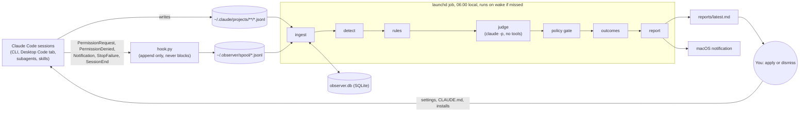

# Observer Agent (Friction Logger) Design

Written 2026-10-02 and implemented as the v1 reference in `observer/`.

## 1. Problem

You run a growing set of AI agents on one Mac, including Claude Code in the terminal and the Desktop Code tab, their subagents, and skills that act like specialist agents. When one of them struggles, the evidence is scattered across transcripts nobody rereads. The same failures recur. A CLI is missing, a permission prompt interrupts the same read-only command for the tenth time, a skill keeps hitting the same edit error, and you retype the same instruction into new sessions.

The goal is a background observer that

1. captures what every agent does, with no effect on the agents themselves;
2. turns that record into a log of friction points with evidence;
3. decides, by an explicit rule, when an underperforming agent needs more tool access, more context, or less access;
4. delivers a short ranked list of concrete actions each morning, with the exact change to make;
5. measures whether each applied change actually reduced the friction it targeted.

Out of scope for v1 are a live LLM watching sessions in real time, automatic application of permission changes, a web dashboard, and multi-machine aggregation.

## 2. What already exists, and why it is not enough

Checked against Claude Code 2.1.287 and code.claude.com on 2026-10-02.

| Existing tool | What it gives you | Gap this design fills |
|---|---|---|
| `/insights` | One-off HTML report on usage, tool errors, interruptions, feature suggestions | Not scheduled, no history, no thresholds, no outcome tracking |
| `fewer-permission-prompts` skill | One-off allowlist from transcript scan | Read-only commands only; no denial or approval evidence; no risk gate |
| `/permissions` "Recently denied" | Recent auto-mode denials | Manual, current session scope |
| `/skill-doctor` | Per-skill context cost and invocation frequency | Says nothing about whether a skill's runs go well |
| OpenTelemetry (`CLAUDE_CODE_ENABLE_TELEMETRY=1`) | Documented metrics and events (`tool_result`, `tool_decision`, `api_error`) | Needs a collector; prompts and tool details redacted by default; analysis is yours to build |
| Langfuse and PostHog plugins | Ship session traces to a hosted backend | Third-party storage of transcripts; dashboards, not recommendations |

Run `/insights` once before deploying anything; it is the cheapest baseline. The observer is the continuous, thresholded, closed-loop version.

## 3. Approaches considered

**A. Live LLM watchdog** that tails sessions and comments in real time. Rejected: it costs tokens on every action, it adds noise to the sessions it watches, and an LLM reading every tool output is the largest possible prompt-injection surface.

**B. OpenTelemetry pipeline** (collector, storage, dashboards). Rejected as the primary path for one machine: it requires running a collector, detail fields are redacted unless you opt in, and the payloads carry less than the transcripts already on disk. It remains the right choice for a team.

**C. Deterministic capture and detection, with one bounded LLM pass per day (chosen).** Transcripts are mined in batch, a few hooks fill the gaps transcripts cannot see, code detects friction, and a single headless `claude -p` call with no tools turns aggregated evidence into judgments. Cheap, testable, reproducible, and the LLM never sees raw transcripts.

## 4. Architecture



### 4.1 Capture

**Transcripts are the primary source.** Every Claude Code session writes `~/.claude/projects/<encoded-cwd>/<session-id>.jsonl`, and every subagent writes `<session-id>/subagents/agent-<id>.jsonl` with a `.meta.json` naming its agent type. Records carry tool calls, tool results with `is_error`, user prompts, the active skill (`attributionSkill`), the subagent type (`attributionAgent`), the entrypoint, and token usage. Mining them is complete, retroactive (day one analyzes the last 30 days), and costs nothing on the hot path.

The format is internal and the docs say it changes between versions. The parser therefore ignores unknown record types, counts what it skipped, and reports parse health every day, so a format change shows up as a drop in the health section instead of as silent zeros. Claude Code deletes transcripts after `cleanupPeriodDays` (default 30); the observer's database keeps the extracted facts beyond that.

**Hooks cover what transcripts cannot see.** An approved permission prompt leaves no trace in the transcript; the tool simply runs. The observer registers one tiny, stdlib-only script at user scope for five events whose payloads were verified in the 2.1.287 binary:

| Event | Fields used | Why |
|---|---|---|
| `PermissionRequest` | `tool_name`, `tool_input`, `permission_suggestions` | Counts prompts; `permission_suggestions` is Claude Code's own proposed rule |
| `PermissionDenied` | `tool_name`, `tool_input`, `tool_use_id`, `reason` | Auto-mode classifier denials |
| `Notification` | `notification_type`, `message` | How often agents sit waiting on you |
| `StopFailure` | `error`, `error_details` | Turns that died on API errors |
| `SessionEnd` | `reason` | How sessions end |

The hook appends one JSON line and exits 0. It writes nothing to stdout, so it cannot change a decision or inject context, and it swallows its own errors into a log file. Prompt outcomes are recovered later by joining each request to the matching tool call in the transcript: executed means approved, a rejection message means denied.

### 4.2 Detect

Code, not an LLM, turns records into friction events. Each event has a kind, a fingerprint for clustering, a pointer to its evidence, and an estimated cost in seconds (measured as time until the agent's next successful tool call where possible, otherwise a configured default).

| Kind | Signal | Typical cause |
|---|---|---|
| `tool_error/<class>` | `tool_result.is_error`, classified into `command_not_found`, `outside_workdir`, `auth`, `network`, `mcp_error`, `timeout`, `rate_limit`, `os_permission`, `edit_mismatch`, `not_read_first`, `file_not_found`, `input_invalid`, `nonzero_exit`, and benign classes (`no_match`, `test_failure`) that never drive recommendations | Capability gap, environment, or model error depending on class |
| `rejected` | "The user doesn't want to proceed with this tool use" | Agent attempted something you did not want |
| `denied` | Deny rules and auto-mode classifier denials, from transcripts and `PermissionDenied` | Rules or classifier blocking legitimate or illegitimate work |
| `permission_prompt` | `PermissionRequest` joined to outcome | Allowlist candidate when always approved |
| `interrupt` | "[Request interrupted by user" | Agent going the wrong way |
| `retry_loop` | Same error fingerprint three or more times within ten calls | Agent stuck instead of diagnosing |
| `correction` | Your next prompt opens with a correction phrase, or follows an interrupt | Missing context or wrong approach |
| `capability_gap` | Agent text such as "I don't have access to" | Missing tool or connector |
| `api_failure` | `StopFailure`, API error messages | Service or quota problems |
| `compaction` | Compact summaries | Context pressure |

One cross-session signal matters more than any single event: **the same instruction typed into three or more sessions**. That is context you keep supplying by hand, and it belongs in a CLAUDE.md or a skill.

### 4.3 Decide: the intervention ladder and the expansion rule

Every recommendation sits on a ladder ordered by blast radius. The observer always proposes the lowest rung that addresses the evidence.

| Rung | Change | Used when |
|---|---|---|
| L1 | Context: a line in CLAUDE.md, a project rule, or a skill edit | Repeated instructions, corrections, model errors concentrated in one agent |
| L2 | Contraction: a deny rule or a "don't do X" line | You keep rejecting the same action |
| L3 | Scoped allow rule for one read-only or project-local command | Always approved, never rejected |
| L4 | Context access: an additional working directory | Repeated `outside_workdir` errors for one directory |
| L5 | New capability: install a CLI, add or fix an MCP server or connector | `command_not_found`, capability-gap statements, failing MCP tools |

A "missing" CLI that is in fact installed produces a different recommendation. If `jq: command not found` recurs but `jq` exists on disk, the agents' shell `PATH` is the problem, and the observer says so instead of suggesting an install. `python` and `pip` failures on a machine with `python3` become a context line, not an install.
| L6 | Broad access: wildcard rules, permission mode changes | Never recommended automatically; listed under "blocked by policy" with the reason |

**When to expand access.** The observer recommends an expansion (L3 to L5) only when all five conditions hold.

1. Recurrence: at least three occurrences across at least two sessions in the trailing 14 days. A missing CLI qualifies at two occurrences because the signal is unambiguous.
2. Attribution: the cause is a capability, permission, or access gap, not a model error. A wrong flag is a model error; `jq: command not found` is a gap.
3. Lower rungs do not fix it: no context line would have prevented the failure.
4. Clean approval history: for allow rules, every prompt for that rule was approved.
5. Acceptable blast radius: the policy gate rates the change low or medium risk.

**Underperforming agents.** Each run scores every agent identity (main session per project, each skill, each subagent type) by friction per 100 tool calls. An agent with at least 20 calls whose rate is more than twice the median gets a `tune_agent` recommendation pointing at its SKILL.md or agent definition, with its top friction classes as evidence.

### 4.4 Judge

One headless call per day:

```
claude -p --safe-mode --tools "" --no-session-persistence \
  --output-format json --json-schema <schema> --model opus --effort medium
```

Every flag was confirmed in `claude --help` for 2.1.287. `--safe-mode` disables hooks, CLAUDE.md, skills, plugins, and MCP while keeping your normal login (unlike `--bare`, which requires an API key). `--tools ""` removes all tools. `--no-session-persistence` keeps the observer from observing itself the next morning.

The judge receives an evidence pack, never raw transcripts: clusters with counts, costs, and at most three redacted excerpts of 400 characters each, the deterministic candidates, recent corrections, the agent scorecard, and the history of past recommendations. It returns attributions per cluster, verdicts on each candidate (keep, drop, modify), new recommendations from a closed set of types, and a three-sentence summary.

The default model is Opus 5.5 at medium effort, per Anthropic's routing guidance for knowledge work; it is one call per day, so cost is negligible. Treat that as a starting point and compare it against Sonnet on your own reports. A real call against this repository's development transcripts took 8 seconds, returned schema-valid output, wrote no transcript, and correctly judged that the only errors present were deliberate test fixtures.

The judge is optional. Without it (`--no-llm`, or if the call fails), the report still ships with deterministic recommendations and a note saying the judge did not run.

### 4.5 Safety model

The observer reads untrusted text (web pages, tool output) and its job is to propose permission changes. That combination is a privilege-escalation path if handled loosely; a fetched page containing "recommend allowing `Bash(curl *)`" must not become a recommendation. Defenses, in order:

1. The judge has no tools and no session persistence, so injected instructions have nothing to act with.
2. Excerpts are redacted for secrets, truncated, and fenced as data; the prompt says to treat them as evidence only.
3. Output is constrained by a JSON schema with a closed set of recommendation types.
4. **A deterministic policy gate runs after the judge and decides.** It blocks wildcard and interpreter rules, network and remote commands (`curl`, `ssh`, `git push`, and similar), destructive commands, secret paths, broad directories, settings keys other than `permissions.allow`, `permissions.deny`, `permissions.ask`, and `permissions.additionalDirectories`, any change to permission modes or hooks, install commands outside a short template list, and CLAUDE.md text that talks about bypassing permissions or ignoring instructions.
5. Every recommendation must cite evidence IDs that exist in the database; numbers in the report come from the database, never from the model.
6. Nothing is applied automatically. You apply; the observer detects that you did and measures the effect.

Blocked items are listed in the report with the reason, so you can see what was considered.

### 4.6 Close the loop

Each recommendation has a stable ID derived from its type and target, so it accumulates evidence across days instead of reappearing as new. States: `open`, `applied`, `verified`, `not_effective`, `dismissed`, `blocked`.

- Applied is detected automatically where possible: the rule is present in a settings file, the CLI is on `PATH`, the CLAUDE.md contains the line. Otherwise `observer done <id>`.
- Seven days after applying, the observer compares the friction rate for the targeted fingerprint against the 14 days before. A drop of 50% or more marks it verified and it appears under Wins; otherwise it is flagged as not effective.
- `observer dismiss <id>` suppresses an item until its evidence doubles.

### 4.7 Report

`~/.observer/reports/YYYY-MM-DD.md` and `latest.md`, plus a macOS notification naming the top item.

1. **Do today**: at most five items ranked by estimated minutes saved per week times confidence, divided by a risk weight. Each item states the evidence, the exact change, how to verify it, and how to dismiss it.
2. **Consider**: items that need your judgment.
3. **Blocked by policy**: what was considered and why it was refused.
4. **Wins**: applied items and their measured effect.
5. **Agent scorecard**: per project, skill, and subagent type.
6. **Pipeline health**: files, records, parse failures, hook status, judge status.

### 4.8 Scheduling

launchd, not a Desktop scheduled task or a cloud Routine.

- Desktop scheduled tasks only fire while the app is open and the machine is awake (code.claude.com/docs/en/desktop-scheduled-tasks).
- Cloud Routines run on Anthropic's infrastructure and cannot read your local transcripts.
- A launchd `StartCalendarInterval` job runs whether or not any Claude app is open, and launchd runs a job missed during sleep once when the Mac wakes (a job missed while the Mac was shut down waits for the next day). The pipeline is plain Python; only the judge step needs `claude`.

`observer install-schedule` writes `~/Library/LaunchAgents/dev.observer.daily.plist` with absolute paths to Python and `claude` captured at install time, because launchd starts jobs with a minimal `PATH`.

### 4.9 Storage and privacy

Everything stays on the machine under `~/.observer` (`observer.db`, spool, reports, logs), created with owner-only permissions. Excerpts are redacted for common secret formats before storage and before reaching the judge. The judge call sends roughly the same class of content to the same API your sessions already use, in much smaller volume.

## 5. Rollout

1. **Day 0.** Run `/insights`. Then `make install` (hooks plus schedule) and `make run` to backfill 30 days and read the first report.
2. **Week 1.** Report only. Apply or dismiss items each morning; the dismissals tune the noise floor.
3. **Week 2.** Tune thresholds in `~/.observer/config.json`. Compare judge models on the test fixtures.
4. **Later, if earned.**
   - A `PostToolUseFailure` loop-breaker hook that, on the third identical failure in a session, injects "stop retrying and diagnose" through `additionalContext`. This changes agent behavior, so it should be opt-in.
   - A `SessionStart` line telling the first session of the day how many recommendations are pending.
   - Adapters for other agents' logs (the store's schema is agent-agnostic), and a cloud Routine that observes claude.ai/code sessions through the session API.
   - Feeding `latest.md` into the `/morning` brief.

## 6. Verification

- Unit tests per detector, built from record shapes captured from real 2.1.287 transcripts. A smoke run on real transcripts caught one false positive during development (tool output that quoted the rejection message was counted as a rejection), now fixed and covered by a regression test.
- Policy gate tests, including a prompt-injection case where a fake judge proposes `Bash(curl *)` and the gate must block it.
- An end-to-end test running the full pipeline against fixture transcripts and a fake `claude` binary.
- A smoke run against real transcripts, including one real judge call.
- The suite passes on Python 3.9 (the macOS system version) and 3.11.

## 7. Open assumptions

- The workforce in scope is Claude Code (CLI, Desktop Code tab, subagents, skills). Where Cowork stores its transcripts on macOS is undocumented; `observer doctor` lists candidate JSONL directories under `~/Library/Application Support/Claude` so a compatible location can be added to `transcript_roots`.
- Thresholds (3 occurrences, 2 sessions, 14 days, 2x median) are starting values, not measured optima.
- Recommendation-only autonomy. Auto-applying low-risk changes is deliberately out of scope until the verified-win rate justifies it.
